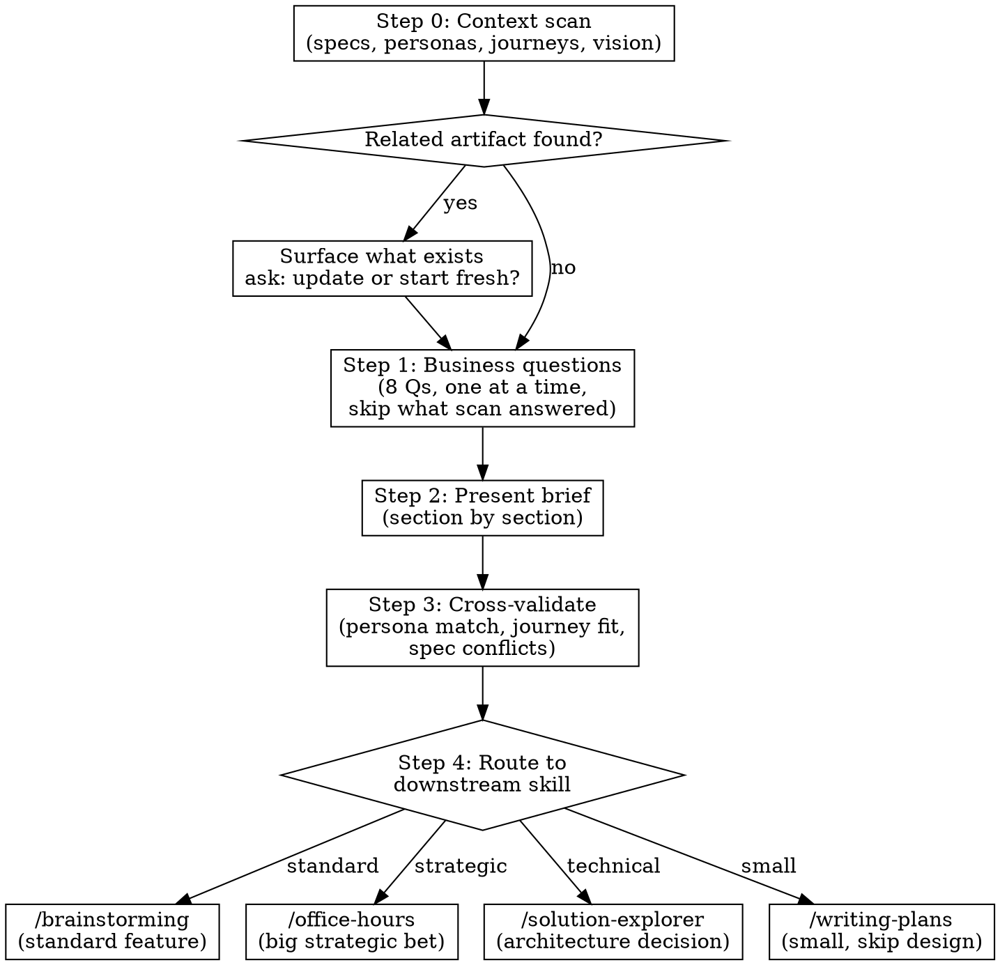

# Feature Discovery

## Overview

Turn a raw feature idea into a validated, cross-referenced business brief before any technical
design begins. The output is a Feature Ship Brief — a permanent product-layer document that
captures the strategic bet, user problem, success condition, and MVP hypothesis.

This skill does three things that jumping straight to design misses:
1. **Checks what already exists** — specs, personas, journeys that relate to this idea
2. **Validates the business case** — 8 structured questions that force honest answers
3. **Routes to the right next skill** — based on what the discovery learned

**Core principle:** Understand why before how. A feature that solves the wrong problem
perfectly is worse than no feature at all.

**Announce at start:** "I'm using feature-discovery to validate this idea before we design anything."

## Repository Mode Gate

Before Step 0, detect repository mode from `REPO_MODES.md` and state it.

- `bootstrap`: if personas/journeys/specs do not exist yet, produce an initialization brief
  and route to scaffold-first flow.
- `convert`: validate ideas against existing repo artifacts and map findings to current
  structure before proposing consolidation.

<HARD-GATE>
Do NOT ask about implementation, architecture, data models, tech stack, or effort until:
1. The context scan is complete
2. All business questions are answered (or skipped — see escape hatch below)
3. The Feature Ship Brief is written and confirmed

If the user mentions technical details, acknowledge and park them:
"Good to know — I'll hold that for the technical design phase. Let's nail the business case first."

If they push back, restate once: "I want to make sure the business case is solid before we
design the system — technical choices should follow from the problem definition. A couple more
questions and we'll be there."

If they push a second time, the gate is absolute — hold without argument and return to the
next business question.

**ESCAPE HATCH — when Step 0 reveals this is NOT a new feature:**

If the context scan (Step 0) reveals any of these, skip the business questions entirely:
- **Concept fragmentation** — two components with different names creating the same entity
- **Pipeline break** — UI exists but bypasses validation/security that the consumer side depends on
- **Missing journey for existing functionality** — the code works, it just has no journey or spec

In these cases, this is a fix/consolidation task, not a new feature. Present your Step 0
findings directly and route to the appropriate skill (writing-plans for a fix, journey-sync
for a missing journey, spec-ac-sync for missing ACs). Don't force 8 business questions on
a problem the codebase already fully defines.
</HARD-GATE>

---

## Process



---

## Step 0: Context Scan

Before asking a single question, scan the project for existing artifacts related to the idea.

### What to check (in this order — high-level first, detail only when needed)

**Tier 1: Product-level truth (always check these first)**

These tell you whether the feature idea already has a home in the product, which
users it affects, and how it connects to existing flows. Start here — most feature
questions are answered at this level without needing to read code.

```
1. Journeys — glob docs/specs/journeys/*.feature.md
   → Does an existing journey touch this area? Which personas does it serve?
   → Does the journey's Background assume data that relates to this feature?
   → Is there a supply-side gap — a journey that consumes this concept but
     no journey where a producer creates it?
   Read the journey fully, not just the title. The Journey Analysis section
   (Logical Issues, Missing Transitions, Product Gaps) often directly answers
   whether this feature idea has already been identified as a gap.

2. Personas — glob docs/specs/personas/P*.md
   → Which persona(s) would this serve? Read their pains, goals, patience budget.
   → Does any persona's "Skill Implications" section mention this area?
   → Is there a persona gap — a user type that exists in the product but has
     no persona file? (e.g., the product has admin features but no admin persona)

3. Vision / CLAUDE.md — read docs/specs/vision.md or the project CLAUDE.md
   → Does this align with the product's stated direction?
```

**Tier 2: Feature-level detail (only when Tier 1 points you here)**

Drill into a specific feature spec only when journeys or personas reference it,
or when you need to understand the exact ACs, entity schema, or user stories for
the domain this feature idea touches.

```
4. Feature specs — glob docs/specs/features/ (or project equivalent)
   → Only read specs that Tier 1 pointed you to (e.g., the journey covers
     "flash deals" so read the flash deals spec for AC detail)
   → Check the AC coverage table — are there gaps the feature idea would fill?
   → Check Spec-Code Sync Status — are there known drifts?

5. Recent work — git log --oneline -20
   → Is someone already building something related?
```

**Tier 3: Codebase reality (only when Tier 1+2 leave questions unanswered)**

Read actual source code when you need to verify whether something that's specced
actually exists, whether a UI component works as described, or whether two things
that sound different are actually the same entity.

```
6. Codebase reality — grep/read the actual source code
   → Does the feature already exist in code? Is it partially built?
   → Who calls it? What entity does it use? What security/validation does it go through?
   → Is there existing backend infrastructure the feature can leverage?
   → Are there two components creating the same entity under different names?
```

**Why this order matters:** Journeys and personas encode product decisions —
who the users are, what flows matter, what gaps have been identified. Feature
specs encode detailed requirements. Code encodes what actually got built.
Starting with code leads to "what exists?" thinking. Starting with journeys
leads to "what should exist for each user?" thinking — which catches gaps
like a consumer journey with no producer counterpart.

**The codebase is the ground truth.** Specs, journeys, and personas describe intent. The
code describes reality. When investigating whether a feature idea is new, partially built,
or a duplicate, ALWAYS read the relevant source files. Grep for entity names, function calls,
component imports. The answer to "who has this problem?" and "what do they do today?" is
often sitting in the code — don't ask the user questions the codebase can answer.

For example: if the user asks about a "last hour offer" feature, don't ask "does an owner
flow for this exist?" — grep for the component, read it, check what entity it creates,
check if it goes through validation, check what other pages create the same entity. Then
present findings: "This component exists at X, it creates Y entity, but it bypasses Z
validation that the existing consumer-side page relies on."

### Concept deduplication and industry pattern matching

When the context scan finds code related to the feature idea, check for concept
fragmentation — the same underlying entity or user goal served by multiple components
under different names. Two components that create the same entity ARE the same feature,
no matter what they're called.

**Identify the industry pattern.** Most product features map to well-known patterns.
Name the pattern and check whether the product covers all sides:

| Pattern | Producer | Consumer | System |
|---------|----------|----------|--------|
| Flash deals / time-limited offers | Seller creates (validation, plan gating) | Buyer browses, claims (limits, confirmation) | Notifications, expiry cleanup |
| Referral programs | Referrer shares (tracking) | Referee signs up (attribution) | Double-sided rewards, fraud |
| Booking / reservations | Provider sets availability | Customer books (confirmation) | No-show, waitlist |
| Reviews / ratings | Customer writes (purchase gate) | Owner responds (moderation) | Aggregate scoring |
| Loyalty / points | System awards on purchase | Customer redeems (balance check) | Tier progression, expiry |
| Content publishing | Creator publishes (draft→live) | Audience discovers (feed, search) | Moderation, analytics |

When you identify the pattern, present the diagnosis — don't ask the user to tell you:
"This is a flash deals pattern. The consumer side (browse + claim) is fully built. The
producer side (create deal) exists as a broken shortcut that bypasses your security
pipeline. The system side (notifications) is built but unreachable because the producer
path doesn't go through it. This isn't a new feature — it's a pipeline fix."

**If two names exist for the same concept**, recommend consolidation: "The codebase calls
this 'Lightning Slot' (entity + consumer page) and 'Last Hour Offer' (producer button).
These are the same thing — a flash deal. Pick one name. The entity name usually wins."

This analysis replaces business questions Q1-Q3 when the codebase already contains the
answer. Don't interrogate the user about problems the code reveals.

### What to do with findings

**If a feature spec already exists** for this exact idea:
Surface it. "There's already a spec for this: `docs/specs/features/feature-matching.md`. Want to
update it, or is your idea different from what's described there?"

**If a persona match is found:**
Name it. "This sounds like it serves P1 (Collaborator) — their top pain is finding reliable
partners. Their challenges doc mentions [specific pain]." Use this to inform Q1 (who) and Q2
(how bad) — don't re-ask what the persona already answers.

**If a journey overlaps:**
Flag it. "J02 (daily matching loop) covers the flow you're describing. This feature would
extend/modify that journey at the [specific scenario] step."

**If vision alignment is unclear:**
Be honest. "The vision doc focuses on trust-based matchmaking. This idea is about [X] — how
does it connect to the core mission?"

**If nothing exists:**
Say so. "No existing specs, personas, or journeys relate to this idea. Starting fresh."

---

## Step 1: Business Questions (One at a Time)

Ask these in order. One question per message. Listen fully before moving on.

**Scale to what the user already said AND what the codebase reveals** — if the context scan,
the codebase grep, or the user's initial message already answered a question, skip it.
Don't ask the user questions the code can answer. If the code shows that a component creates
Entity X directly (bypassing secureOperation), that answers Q1 (who), Q2 (how bad — it's a
security gap), and Q7 (MVP — fix the pipeline). Present your findings and confirm, don't
interrogate.

| # | Question | What you're learning |
|---|----------|----------------------|
| 1 | **Who has this problem?** Which specific user, in what situation? | Problem owner |
| 2 | **How bad is it?** What do they do today instead? What's the cost of not solving it? | Pain severity |
| 3 | **Why now?** What changed that makes this the right moment? | Timing argument |
| 4 | **What's the bet?** What's the non-obvious insight — the thing that's true that most people haven't noticed? | Strategic thesis |
| 5 | **What does winning look like?** One metric. If this works, what moves? | Success condition |
| 6 | **What's the kill condition?** What result in 30-60 days tells you this was wrong? | Failure signal |
| 7 | **What's the MVP?** Smallest thing that proves or disproves the bet. User behavior, not features. | Validation scope |
| 8 | **What are you explicitly NOT building?** | Scope boundary |

### Informed by Step 0

When the context scan found relevant artifacts, weave them in:

- **Persona found:** "Based on P1's profile, they struggle with [pain]. Is that the person you mean, or someone else?"
- **Journey found:** "J02 already has users doing [thing] at the [step]. Is your MVP extending that, or something separate?"
- **Spec found:** "The matching spec mentions [related concept]. Is your bet that the current approach is wrong, or that it needs an addition?"

### If the user can't answer one

Don't invent it. Mark the section as a gap in the brief: "Gap: user couldn't articulate a
kill condition — worth defining before committing engineering time."

Honest gaps > invented answers.

---

## Step 2: Present the Brief (Section by Section)

Present each section, ask "Does this capture it correctly?" after each. Revise before proceeding.

1. **The Bet** — strategic thesis in 2-3 sentences
2. **Who / Problem** — user + pain, specific and concrete
3. **Why Now** — the timing argument
4. **Working Backwards** — one-paragraph press release as if it shipped and worked
5. **Success Metric** — the one number
6. **Kill Condition** — what failure looks like
7. **MVP** — what you're building first, in user-behavior language
8. **Explicit Non-Scope** — what's out

Use the template at `feature-ship-brief-template.md` for the final document format.

---

## Step 3: Cross-Validation

After the brief is confirmed, cross-reference it against the project's existing artifacts.
Report findings honestly — this is the skill's unique value over jumping to design.

### Persona validation

| Check | Action |
|-------|--------|
| Brief's "Who" matches an existing persona | Link it: "Serves P1 (Collaborator)" |
| Brief's "Who" is a new user type not in personas | Flag: "This introduces a new user type — run /persona-builder to create P7 before journey work" |
| Brief's "Who" contradicts a persona's stated needs | Warn: "P2 (Visionary) explicitly wants [X], but this brief assumes they want [Y]" |

### Journey validation

| Check | Action |
|-------|--------|
| MVP implies a new user flow | Note: "The MVP flow doesn't fit any existing journey — /journey-sync will need to create a new one" |
| MVP extends an existing journey | Note: "This extends J02 at the [step] — journey-sync should add scenarios" |
| MVP conflicts with an existing journey | Warn: "J01 assumes [X] at step 3, but this feature changes that behavior" |

### Spec validation

| Check | Action |
|-------|--------|
| Feature touches an existing spec's domain | Note: "The matching spec will need updating if this ships" |
| Feature conflicts with existing spec behavior | Warn: "The trust spec says [X], but this brief proposes [Y] — resolve before design" |
| No related specs | Note: "Clean domain — no spec conflicts" |

### Vision alignment

| Check | Action |
|-------|--------|
| Clearly aligned | Note: "Directly supports [vision goal]" |
| Tangentially related | Note: "Supports vision indirectly through [connection]" |
| Misaligned | Warn: "This doesn't connect to the stated vision. That's not necessarily wrong — the vision may need updating — but be explicit about it" |

---

## Step 4: Write, Commit, and Route

### Write the brief

Save to the project's spec directory: `docs/specs/features/YYYY-MM-DD-<feature-name>-brief.md`
using the template. Include a `## Cross-Validation` section at the end with findings from Step 3.

Commit to git.

### Route to the right downstream skill

Based on what the discovery learned, recommend the best next step:

| Signal | Recommendation |
|--------|---------------|
| Standard product feature, clear scope, personas exist | **/brainstorming** — "The business case is solid. Let me invoke brainstorming with this brief as context for technical design." |
| Big strategic bet, uncertain market, startup-level risk | **/office-hours** — "This is a significant bet. I'd recommend a deeper diagnostic with /office-hours before designing. The brief gives it a head start." |
| Multiple viable architectures, unclear technical approach | **/solution-explorer** — "The what is clear but the how has multiple paradigms. Let me invoke /solution-explorer to map the technical options." |
| Small scope, obvious implementation, no design needed | **/writing-plans** — "This is small enough to plan directly. Want me to invoke /writing-plans with the brief as input?" |
| Brief has gaps, persona doesn't exist yet | **Pause** — "Before design, I'd suggest: (1) /persona-builder to create a persona for [user type], (2) then come back to route to brainstorming." |
| Feature has UI components, needs visual exploration | **/design-shotgun** — "This has significant UI work. Before the full design, want to explore visual directions with /design-shotgun?" |
| Concept fragmentation or pipeline break — not a new feature | **/writing-plans** — "This isn't a new feature. It's a broken pipeline / naming mess. Skip the brief, go straight to a fix plan." |
| Consumer journey exists but producer journey is missing | **/journey-sync** (Mode 2: Expand) — "The consumer flow is covered but no journey describes how the producer creates this data. Route to journey-sync to add the producer journey, then come back for any remaining gaps." |
| Feature touches multiple personas across roles | **/journey-sync** then back here — "This crosses role boundaries. Run journey-sync to map the full lifecycle across personas first — it'll surface which side is missing. Then come back to brief the gap." |

Present the recommendation with reasoning. Let the user override.

### Handoff context

When invoking the downstream skill, pass:
- The brief path: `docs/specs/features/YYYY-MM-DD-<name>-brief.md`
- The cross-validation findings (persona links, journey overlaps, spec conflicts)
- Any technical details the user mentioned that were parked during business questions

---

## Key Principles

- **One question at a time** — don't overwhelm with multiple questions
- **Park technical details** — acknowledge and defer to design phase
- **Honest answers beat optimistic ones** — a weak business case caught here saves weeks of engineering
- **The bet is the hardest part** — push on the non-obvious insight
- **MVP means smallest test of the hypothesis** — not "quick version of the full feature"
- **Cross-validation is the unique value** — any skill can ask business questions, only this one checks what already exists

---

## What This Produces

The Feature Ship Brief (business layer only). It does NOT contain:
- Schema or data model (comes from brainstorming / solution-explorer)
- Architecture decisions (comes from brainstorming / solution-explorer)
- Implementation plan (comes from writing-plans)
- Technical risks (comes from brainstorming / plan-eng-review)

The brief is permanent and lives in the project's spec directory. It gets updated as the feature
evolves (status: Draft -> In Progress -> Production). It is the reference any future agent or
team member reads to understand what a feature is and why it exists.

---

## Baseline Failure This Skill Fixes

Without this skill, agents jump from "user mentions feature idea" to writing technical specs
and data models. The business questions never get asked. Existing personas are ignored. Journey
overlaps are missed. The result: specs with structural gaps — undefined success conditions,
features that don't serve any persona, journeys that contradict each other — that only surface
during implementation or post-launch.
