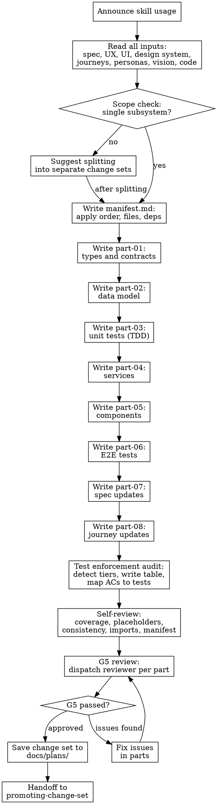

# Writing Change Sets

## Overview

A change set is not a description of changes. It IS the changes. Every file, every function, every test, every spec update — written as exact content that the promoter copies verbatim into the codebase.

The agent writing the change set has the full context: every spec, every journey, every AC, every technical design decision. The promoter does not need context — they apply.

**Announce at start:** "I'm using the writing-change-set skill to produce the change set."

**Context:** This should be run against a BASELINED feature spec (status: BASELINED after G4 review). The technical design section must be complete.

**Save change set to:** `docs/plans/<YYYY-MM-DD>-<feature-name>/`

Scale to the task. A one-file bug fix produces a single part with a trivial manifest. A new subsystem produces eight parts. When you believe parts can be merged or omitted, ask the user for permission — do not elide silently, and do not split artificially when it does not serve the work.

---

## Inputs

Before writing anything, read and hold in context:

| Artifact | Path | What You Extract |
|----------|------|-----------------|
| Feature Spec | `docs/specs/features/<name>.md` | Stories, ACs, dependencies, technical design section |
| UX Design | `docs/specs/ux/<name>.md` | Screen flows, states, error handling |
| UI Design | `docs/specs/ui/<name>.md` | Component specs, design tokens, responsive behavior |
| Design System | `docs/specs/design-system.md` | Tokens, typography, spacing, component patterns |
| Journey Docs | `docs/specs/journeys/J*-<name>.feature.md` | Gherkin scenarios, AC cross-references, Layer 3 findings |
| Personas | `docs/specs/personas/P*.md` | Who uses this, skill implications |
| Vision | `docs/specs/vision.md` | Boundaries, principles |
| Existing Code | Glob the source tree | Current patterns, imports, naming conventions, test structure |

If any required artifact is missing or stale, stop and tell the user. Do not invent constraints that should have been established in prior phases.

---

## Scope Check

If the spec covers multiple independent subsystems, it should have been broken into sub-feature specs during earlier phases. If it was not, suggest breaking this into separate change sets — one per subsystem. Each change set should produce working, testable software on its own.

---

## Output Structure

A change set is a directory of markdown files. Each file contains the exact content of one or more source files, grouped by concern.

```
docs/plans/<YYYY-MM-DD>-<feature-name>/
  manifest.md                    <- index, apply order, dependencies, files touched
  part-01-types-and-contracts.md <- type definitions, interfaces, schemas
  part-02-data-model.md          <- migrations, seed data
  part-03-tests-unit.md          <- unit tests (TDD: written BEFORE implementation)
  part-04-services.md            <- backend logic, API handlers
  part-05-components.md          <- UI components, pages
  part-06-tests-e2e.md           <- E2E tests (written after implementation parts)
  part-07-spec-updates.md        <- feature spec status changes, AC updates
  part-08-journey-updates.md     <- journey doc changes
```

**Part numbering reflects apply order, not authoring order.** Tests (part-03) are written before services (part-04) and components (part-05) — TDD within the change set — but applied after types so the imports resolve. The manifest specifies the exact apply order.

**Not every change set needs all eight parts.** A backend-only change might have: types, data model, unit tests, services, spec updates. A UI-only change might have: types, components, unit tests, e2e tests, spec updates. Include only what the change requires. Note omitted parts in the manifest with a one-line reason.

---

## Manifest Structure

Every change set starts with `manifest.md`. This is the single source of truth for what the change set contains.

````markdown
# Change Set: <Feature Name>

**Feature Spec:** docs/specs/features/<feature-name>.md
**Status:** BASELINED -> CHANGE-SET-APPROVED (pending review)
**Created:** <YYYY-MM-DD>
**Parts:** <count>

## Apply Order

| Order | Part | Creates/Modifies | Depends On |
|-------|------|-----------------|------------|
| 1 | part-01-types-and-contracts | src/types/<name>.ts (new) | -- |
| 2 | part-02-data-model | migrations/NNN-<name>.sql (new) | -- |
| 3 | part-03-tests-unit | tests/<name>.test.ts (new) | part-01 |
| 4 | part-04-services | src/services/<name>.ts (new) | part-01, part-02 |
| 5 | part-05-components | src/components/<Name>.tsx (new) | part-01, part-04 |
| 6 | part-06-tests-e2e | e2e/specs/<name>.spec.ts (new) | part-05 |
| 7 | part-07-spec-updates | docs/specs/features/<name>.md (modify) | all above |
| 8 | part-08-journey-updates | docs/specs/journeys/J*-<name>.feature.md (modify) | part-07 |

## Files Touched

| File | Action | Part |
|------|--------|------|
| src/types/<name>.ts | CREATE | 01 |
| migrations/NNN-<name>.sql | CREATE | 02 |
| tests/<name>.test.ts | CREATE | 03 |
| src/services/<name>.ts | CREATE | 04 |
| src/components/<Name>.tsx | CREATE | 05 |
| e2e/specs/<name>.spec.ts | CREATE | 06 |
| docs/specs/features/<name>.md | MODIFY | 07 |
| docs/specs/journeys/J*-<name>.feature.md | MODIFY | 08 |

## Omitted Parts

| Part | Reason |
|------|--------|
| part-02-data-model | No database changes in this feature |

## Validation Commands

Run after all parts are promoted:

~~~bash
npm run typecheck
npm run lint
npm run test
npx playwright test e2e/specs/<name>.spec.ts
~~~

## Test Enforcement

| Tier | Required? | Part | Validation Command |
|------|-----------|------|-------------------|
| T1: Typecheck | YES | all | `npm run typecheck` |
| T2: Lint | YES | all | `npm run lint` |
| T3: E2E | YES/NO -- reason | part-06 | `npx playwright test path/to/spec` |
| T4: Unit | YES/NO -- reason | part-03 | `npx vitest run path/to/test` |
| T5: Migration | YES/NO -- reason | part-02 | `db push --dry-run` |
| T6: Coverage | YES/NO -- reason | part-03 | project-specific |

## AC-to-Test Mapping

| AC ID | Description | Test Type | Test Location |
|-------|-------------|-----------|--------------|
| XX-01 | User can do Y | E2E | part-06: e2e/specs/<name>.spec.ts |
| XX-02 | Data transforms correctly | Unit | part-03: tests/<name>.test.ts |
| XX-03 | Permission denied toast | Manual | M1 in test plan |

Every AC must map to exactly one of: `E2E`, `Unit`, `Manual`, or `N/A` (with reason).
No unmapped ACs. If an AC has no test, either write one or explain why it is manual.
````

---

## Part File Structure

Each part file follows the same structure. It contains the EXACT file content — not descriptions, not pseudocode, not "similar to Part N."

````markdown
# Part NN: <Concern Name>

**Change Set:** <Feature Name>
**Apply Order:** N of M
**Depends On:** part-01, part-02 (or "none")

## Task Metadata

~~~yaml
tasks:
  - id: <part-number>
    subject: "<Imperative description>"
    context: fresh
    blockedBy: [<dependency part numbers>]
    parallelGroup: <letter or null>
    tdd: <true|false>
    validation: "<command>"
~~~

## Files

### CREATE: src/types/<name>.ts

~~~typescript
// Exact file content. Every line. Every import. Every export.
// No placeholders. No TODOs. No "add error handling here."

export interface MatchScore {
  userId: string;
  targetId: string;
  score: number;
  factors: ScoreFactor[];
  calculatedAt: Date;
}

export interface ScoreFactor {
  name: string;
  weight: number;
  value: number;
}

export type MatchSortOrder = 'score-desc' | 'recent' | 'name-asc';
~~~

### MODIFY: src/routes/matches.ts

**Context:** Show enough surrounding code to locate the edit unambiguously.

~~~typescript
// BEFORE (lines 45-52):
import { getMatches } from '../services/matches';

export async function matchRoutes(app: FastifyInstance) {
  app.get('/matches', async (req, reply) => {
    const matches = await getMatches(req.user.id);

// AFTER:
import { getMatches } from '../services/matches';
import { calculateScores } from '../services/matchScore';

export async function matchRoutes(app: FastifyInstance) {
  app.get('/matches', async (req, reply) => {
    const matches = await getMatches(req.user.id);
    const scored = await calculateScores(req.user.id, matches);
~~~

**Validation:**
~~~bash
npm run typecheck
~~~
````

---

## Authoring Order: TDD Within the Change Set

The change set is AUTHORED in TDD order even though parts are NUMBERED by apply order. This means you write the parts in this sequence:

| Write Order | Part | Why |
|-------------|------|-----|
| 1st | Types and contracts (part-01) | Everything depends on the type definitions |
| 2nd | Data model (part-02) | Schema informs what tests assert |
| 3rd | Unit tests (part-03) | TDD: tests BEFORE implementation |
| 4th | Services (part-04) | Written to make the tests pass |
| 5th | Components (part-05) | Written to make the tests pass |
| 6th | E2E tests (part-06) | Needs real implementation to reference |
| 7th | Spec updates (part-07) | Reflects what was actually built |
| 8th | Journey updates (part-08) | Reflects what was actually built |

**Why this matters:** When you write unit tests before the service code, you are forced to think about the interface, the edge cases, and the expected behavior BEFORE you write the implementation. This catches design problems early. If you write services first and tests second, the tests tend to mirror the implementation rather than the spec.

### TDD Application by Part

| Part | TDD? | Rationale |
|------|------|-----------|
| Types and contracts | No | Types are self-validating via typecheck |
| Data model | No | Migrations validated by dry-run |
| Unit tests | Yes (this IS the test) | Tests written against types + ACs, before implementation |
| Services | No (tests already exist) | Written to satisfy the tests from part-03 |
| Components | No (tests already exist) | Written to satisfy the tests from part-03 |
| E2E tests | No | Needs running application; comes after implementation |
| Spec updates | No | Documentation, not code |
| Journey updates | No | Documentation, not code |

---

## Task Metadata Fields

Each part's YAML metadata block uses these fields:

| Field | Type | Description |
|-------|------|-------------|
| `id` | number | Part number (matches the part file number) |
| `subject` | string | Brief, imperative title |
| `context` | string | `fresh` / `reuse` / `validate` |
| `blockedBy` | array | Part IDs that must be promoted first |
| `parallelGroup` | string or null | Parts with same group can be promoted in parallel |
| `tdd` | boolean | Whether this part contains tests written before implementation |
| `validation` | string | Command to validate after promotion |

**Context types:**

| Context | When to Use | Effect |
|---------|-------------|--------|
| `fresh` | Default; most parts | Clean agent session, no prior context |
| `reuse` | Part extends a prior part closely | Resume session, saves tokens |
| `validate` | Verification-only part | Read-only, check existing work |

---

## Dependency and Parallel Analysis

When structuring parts, analyze dependencies:

1. **Type dependencies:** Part B imports types from Part A -> `blockedBy: [A]`
2. **File dependencies:** Part B modifies a file created by Part A -> `blockedBy: [A]`
3. **No dependency:** Parts touch different files/modules -> Can parallelize

**Parallel groups:**
- Assign the same `parallelGroup` letter to independent parts
- Parts with `parallelGroup: null` are promoted sequentially
- The promoter dispatches parallel groups together

**Example dependency graph:**
```
Part 01 (Types)            -> blockedBy: [], parallelGroup: null
    |
Part 02 (Data Model)      -> blockedBy: [], parallelGroup: A
Part 03 (Unit Tests)      -> blockedBy: [1], parallelGroup: A  <- parallel with 02
    |           |
Part 04 (Services)        -> blockedBy: [1, 2, 3], parallelGroup: B
Part 05 (Components)      -> blockedBy: [1, 4], parallelGroup: B  <- parallel with 04 if no shared files
    |           |
Part 06 (E2E Tests)       -> blockedBy: [5], parallelGroup: null
Part 07 (Spec Updates)    -> blockedBy: [all above], parallelGroup: null
Part 08 (Journey Updates)  -> blockedBy: [7], parallelGroup: null
```

---

## No Placeholders

Every part must contain the actual content the promoter needs. These are **change set failures** — never write them:

- "TBD", "TODO", "implement later", "fill in details"
- "Add appropriate error handling" / "add validation" / "handle edge cases"
- "Write tests for the above" (without actual test code)
- "Similar to Part N" (repeat the content — parts are independently promotable)
- Steps that describe what to do without showing the exact code
- References to types, functions, or methods not defined in any part
- Comments like "// ... rest of file unchanged" (show exact content or use MODIFY with BEFORE/AFTER)

---

## File Operations

Every file in every part uses one of two operations:

### CREATE

The part contains the complete file content. Every line, every import, every export.

### MODIFY

The part contains BEFORE/AFTER blocks with enough surrounding context (at least 3 lines) to locate the edit unambiguously. The promoter uses these as Edit tool inputs.

**For large modifications** (more than 50% of the file changes), use CREATE with the full new content instead of MODIFY. It is less error-prone.

---

## Test Enforcement Audit

Run this audit after writing all parts but before the review.

### Step 1: Detect project test infrastructure

```bash
# Check for test runners and scripts
grep -E '"test|"lint|"typecheck|"e2e|"check' package.json 2>/dev/null
ls vitest.config.* jest.config.* playwright.config.* 2>/dev/null
```

### Step 2: Evaluate which tiers apply

| Tier | Tool | Required When | Skip When |
|------|------|---------------|-----------|
| **T1: Typecheck** | `tsc --noEmit` or equivalent | Always (if TS project) | Non-TS project |
| **T2: Lint** | `eslint`, `npm run lint` | Always | No linter configured |
| **T3: E2E** | Playwright, Cypress, etc. | Change set adds/modifies user-visible behavior | Pure backend, types-only, config, docs |
| **T4: Unit** | Vitest, Jest, etc. | Change set adds business logic, parsers, transformers, algorithms | Pure UI (covered by E2E), simple CRUD, config, types |
| **T5: Migration** | DB-specific dry-run | Change set includes SQL migrations | No DB changes |
| **T6: Coverage** | Project-specific | Change set creates new test files | No new test files |

### Step 3: Write the enforcement table into the manifest

The `## Test Enforcement` table in `manifest.md` (see Manifest Structure above) is the output of this audit.

**Rules:**
- T1 + T2 must always be YES (if the project has them)
- T3 must be YES for any change set with UI changes
- T4 must be YES for any change set with business logic
- Every YES row must reference the specific part that contains the tests
- Every NO row must have a one-line reason

### Step 4: Verify test parts exist

For each YES tier, verify a part in the change set covers it:
- **T3 (E2E):** part-06-tests-e2e must exist with full Playwright test code
- **T4 (Unit):** part-03-tests-unit must exist with full test code
- **T5 (Migration):** part-02-data-model must include a dry-run validation command
- **T1/T2:** The manifest's Validation Commands section must include both typecheck and lint

If a required tier has no corresponding part, add it before proceeding.

### Anti-patterns (DO NOT)

- **"Tests in a follow-up PR"** — No. Tests ship with the feature.
- **"Typecheck is enough"** — Typecheck catches type errors, not behavior bugs.
- **"We'll test manually"** — Only for things that genuinely cannot be automated.
- **Single button-exists smoke test** — Not AC coverage. Tests must verify behavior.

---

## Spec and Journey Updates

### Part 07: Spec Updates

Every change set must include spec updates. The spec update part modifies the feature spec to reflect what was built:

1. Update status fields (BASELINED -> CHANGE-SET-APPROVED pending review)
2. Add or update sections for any RPC functions, API endpoints, or tools introduced
3. Update any existing section that describes behavior the change set modifies
4. Remove or correct anything the change set renders obsolete
5. Update AC status markers where applicable

### Part 08: Journey Updates

When the feature touches user-facing behavior, include journey updates:

1. Update or create BDD journey docs with Gherkin scenarios tracing AC IDs
2. Update the journey index if new journeys are added
3. Update cross-references in other journeys affected by this change

**Skip when:** The feature is infrastructure-only (no user-facing UI or behavior changes). Note in manifest: "part-08-journey-updates omitted -- no user-facing changes."

---

<!-- [custom:start] -->
## E2E Test Patterns

When writing part-06-tests-e2e:

### Filter/Toggle Default State
When the change set includes pages with favorites/filter toggles (e.g., "Show Favorites Only"), the E2E tests MUST:
- Document the filter's **default state** (on or off)
- Document what **data must exist** for content to render
- Include `beforeEach` setup that ensures this data exists before every test
- Include a "Browse All" / "clear filter" fallback for navigateAndWait helpers

### Subscription Tier Check
When the change set includes tests that create entities gated by subscription limits, the E2E tests MUST:
- Include a `beforeAll` step to verify the test account's subscription allows the operation
- Include a patch step if the subscription has no/zero limit for the resource
- Never assume the test account has adequate limits

```typescript
// Example: In beforeAll
const subs = await ownerClient.entities.Subscription.list();
if (subs.length > 0 && (!subs[0].max_staff || subs[0].max_staff < 5)) {
  await ownerClient.entities.Subscription.update(subs[0].id, {
    max_staff: 10, max_locations: 3, max_deals: 10, max_items: 50
  });
}
```
<!-- [custom:end] -->

---

## Review Protocol (Gate G5)

The change set is reviewed at Gate G5 before promotion. The review checks:

| Category | What G5 Checks |
|----------|---------------|
| Code matches design | Implementation follows the technical design section exactly |
| Tests cover ACs | Every AC maps to a test (unit, E2E, or justified manual) |
| Cross-file consistency | Types used in services match types defined in part-01 |
| No placeholders | Zero TODOs, TBDs, or "implement later" markers |
| Exact content | Every CREATE file is complete; every MODIFY has unambiguous BEFORE/AFTER |
| Apply order valid | Dependencies are correct; no circular references |
| Manifest accurate | Files Touched table matches actual part contents |

### Review Process

After completing the change set:

1. Dispatch the change-set-reviewer subagent (see `plan-document-reviewer-prompt.md`) for each part
   - Provide: part content, manifest, feature spec path
2. If Issues Found:
   - Fix the issues in the part
   - Re-dispatch reviewer for that part
   - Repeat until Approved
3. If Approved: proceed to next part (or handoff if last part)

**Review guidance:**
- Same agent that wrote the change set fixes it (preserves context)
- If loop exceeds 3 iterations on a single part, escalate to human with full findings
- Parts can be reviewed in parallel when they have no dependencies

---

## Self-Review

After writing all parts, review the complete change set with fresh eyes:

**1. Spec coverage:** Skim each AC in the feature spec. Can you point to a part + file that implements it? Can you point to a test that verifies it? List any gaps.

**2. Placeholder scan:** Search every part for red flags: TODO, TBD, "implement later", "similar to Part N", "add error handling", "// ... rest unchanged". Fix them.

**3. Type consistency:** Do the types, method signatures, and property names used in services (part-04) and components (part-05) match what you defined in types (part-01) and what your tests (part-03) expect? A function called `clearLayers()` in part-03 but `clearFullLayers()` in part-04 is a bug.

**4. Import consistency:** Do all imports in all parts resolve to files that exist (either in the codebase already or created by a prior part)?

**5. Manifest accuracy:** Does the Files Touched table in the manifest match the actual files in all parts? Does the Apply Order match the dependency graph?

If you find issues, fix them inline. If you find an AC with no implementation or test, add the content to the appropriate part.

---

## Handoff to Promotion

After the change set passes G5 review:

**1. Record the change set location:**
```
Change set: docs/plans/<YYYY-MM-DD>-<feature-name>/
Manifest: docs/plans/<YYYY-MM-DD>-<feature-name>/manifest.md
Parts: N
Feature spec: docs/specs/features/<feature-name>.md
Status: CHANGE-SET-APPROVED
```

**2. Advise compaction.** Promotion works better with a fresh session. Tell the user:

> "The change set is saved to `docs/plans/<path>/`. Before we start promotion, I recommend compacting this session -- promotion works better with a fresh context window."

**3. Give exact continuation prompt:**

> "After compacting, say: **Promote the change set at `docs/plans/<path>/manifest.md` using promoting-change-set.**"

The promoter reads the manifest, applies each part in order, produces a deviation report, and enters G6 review. The change set author's job is done.

---

## Process Flow



---

## Remember

- **The change set IS the code** -- not constraints for an executor to interpret
- **TDD within the change set** -- write unit tests (part-03) before services (part-04) and components (part-05)
- **Every file is exact** -- CREATE files are complete; MODIFY files have unambiguous BEFORE/AFTER
- **Every AC maps to a test** -- the AC-to-Test Mapping table has no gaps
- **Manifest is the truth** -- if it is not in the manifest, it is not in the change set
- **Scale to the task** -- a one-file fix does not need eight parts
- **No placeholders, ever** -- the promoter copies, it does not generate
- **Hand off to promoting-change-set** -- not to an executor, not to subagent-driven-development
- **Gate G5 before promotion** -- the change set must pass review before anyone touches the codebase
