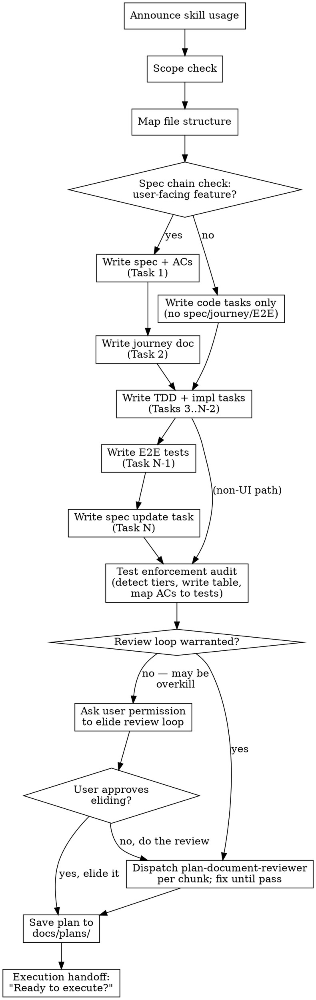

# Writing Plans

## Overview

Scale the plan to the task. A one-file change doesn't need the same plan as a new subsystem. When you believe steps can be safely elided, ask the user for permission — don't elide silently, and don't follow the full process rigidly when it doesn't serve the work.

Write comprehensive implementation plans assuming the engineer has zero context for our codebase and questionable taste. Document everything they need to know: which files to touch for each task, code, testing, docs they might need to check, how to test it. Give them the whole plan as bite-sized tasks. DRY. YAGNI. TDD. Frequent commits.

Assume the implementer is a skilled developer but knows nothing about the codebase. Document everything: files to touch, complete code, validation commands.

**Announce at start:** "I'm using the writing-plans skill to create the implementation plan."

**Context:** This should be run in a dedicated worktree (created by brainstorming skill).

**Save plans to:** `docs/plans/YYYY-MM-DD-<feature-name>.md`
- (User preferences for plan location override this default)

## Scope Check

If the spec covers multiple independent subsystems, it should have been broken into sub-project specs during brainstorming. If it wasn't, suggest breaking this into separate plans — one per subsystem. Each plan should produce working, testable software on its own.

## File Structure

Before defining tasks, map out which files will be created or modified and what each one is responsible for. This is where decomposition decisions get locked in.

- Design units with clear boundaries and well-defined interfaces. Each file should have one clear responsibility.
- You reason best about code you can hold in context at once, and your edits are more reliable when files are focused. Prefer smaller, focused files over large ones that do too much.
- Files that change together should live together. Split by responsibility, not by technical layer.
- In existing codebases, follow established patterns. If the codebase uses large files, don't unilaterally restructure - but if a file you're modifying has grown unwieldy, including a split in the plan is reasonable.

This structure informs the task decomposition. Each task should produce self-contained changes that make sense independently.

## Bite-Sized Task Granularity

## Plan Document Template

**Every plan MUST start with this structure:**

```markdown
# [Feature Name] Implementation Plan

> **For agentic workers:** REQUIRED SUB-SKILL: Use superpowers:subagent-driven-development (recommended) or superpowers:executing-plans to implement this plan task-by-task. Steps use checkbox (`- [ ]`) syntax for tracking.

**Goal:** [One sentence describing what this builds]

**Architecture:** [2-3 sentences about approach]

**Tech Stack:** [Key technologies/libraries]

---

<!-- FORK:START — YAML task metadata block with dependency/parallel/TDD fields -->
## Tasks

~~~yaml
tasks:
  - id: 1
    subject: "Add UserProfile types"
    context: fresh
    blockedBy: []
    parallelGroup: null
    tdd: false
    validation: "npm run typecheck"

  - id: 2
    subject: "Add getUserProfile service + tests"
    context: fresh
    blockedBy: [1]
    parallelGroup: A
    tdd: true
    validation: "npm run test -- getUserProfile"

  - id: 3
    subject: "Add ProfileCard component + tests"
    context: fresh
    blockedBy: [1]
    parallelGroup: A
    tdd: true
    validation: "npm run test -- ProfileCard"

  - id: 4
    subject: "Integrate ProfileCard into Dashboard"
    context: fresh
    blockedBy: [2, 3]
    parallelGroup: null
    tdd: true
    validation: "npm run test -- Dashboard"
~~~

---

## Task 1: Add UserProfile types

[detailed implementation...]

---

## Task 2: Add getUserProfile service + tests

[detailed implementation...]
<!-- FORK:END -->
```

**Note:** Use `~~~` (tildes) for inner code blocks when nesting inside backtick blocks.

---

<!-- FORK:START — Task metadata field reference table -->
## Task Metadata Fields

Each task in the YAML block must have:

| Field | Type | Description |
|-------|------|-------------|
| `id` | number | Unique task identifier |
| `subject` | string | Brief, imperative title (matches TaskCreate) |
| `context` | string | `fresh` \| `reuse` \| `validate` |
| `blockedBy` | array | Task IDs that must complete first |
| `parallelGroup` | string\|null | Tasks with same group can run in parallel |
| `tdd` | boolean | Whether TDD applies to this task |
| `validation` | string | Command to validate task completion |

**Note:** `activeForm` (shown in task spinner) is auto-generated during hydration as "Implementing {subject}".

---
<!-- FORK:END -->

## Task Structure

Each task is a **testable logical unit**, not micro-steps.

<!-- FORK:START — Detailed TDD step pattern with code examples, verification strategy, and anti-patterns -->
````markdown
### Task N: [Component Name]

**Files:**
- Create: `exact/path/to/file.ts`
- Modify: `exact/path/to/existing.ts`
- Test: `tests/exact/path/to/test.ts` (if tdd: true)

- [ ] **Step 1: Write the failing test**

[Complete code - if TDD, include tests in same block]

~~~typescript
// Implementation
export function myFunction(input: Input): Output {
  return transformedResult;
}

// Tests (when tdd: true - same task, same context)
describe('myFunction', () => {
  it('handles normal case', () => {
    expect(myFunction(validInput)).toEqual(expectedOutput);
  });

  it('handles edge case', () => {
    expect(myFunction(edgeInput)).toEqual(edgeOutput);
  });
});
~~~

**Validation:**
~~~bash
npm run test -- myFunction
~~~

**Commit:**
~~~bash
git add src/myFunction.ts tests/myFunction.test.ts
git commit -m "feat: add myFunction with tests"
~~~
```

- [ ] **Step 2: Run test to verify it fails**

## TDD Application Guidelines

- [ ] **Step 3: Write minimal implementation**

| Task Type | TDD? | Rationale |
|-----------|------|-----------|
| Business logic | Yes | Core behavior needs test coverage |
| Data transformations | Yes | Edge cases caught early |
| API endpoints | Yes | Contract verification |
| Service methods | Yes | Integration points need coverage |
| UI components | Sometimes | Visual components may use snapshot/e2e instead |
| Type definitions | No | Types are self-validating via typecheck |
| Config/constants | No | No behavior to test |
| Refactoring | Verify existing | Tests should already exist |
| Bug fixes | Yes | Regression test for the bug |

- [ ] **Step 4: Run test to verify it passes**

**When TDD doesn't apply (`tdd: false`):**
- Validation uses typecheck, lint, or manual verification
- No test files created for this task

- [ ] **Step 5: Commit**

## Verification Strategy

**Per-task validation:** Run task-specific command only
```bash
npm run test -- componentName      # Specific tests
go test ./pkg/specific/...         # Specific package
npm run typecheck                  # For type-only tasks
```

**End-of-plan verification (run once after ALL tasks):**
```bash
npm run lint                       # Full lint
npm run typecheck                  # Full typecheck
npm run test                       # Full test suite
```
````

**Do NOT:**
- Run lint after every task (slow, wasteful)
- Run full test suite per task (use targeted tests)
- Create separate "run lint" or "run typecheck" tasks
<!-- FORK:END -->

---

<!-- FORK:START — Dependency analysis with parallel group patterns -->
## Dependency Analysis

When planning, analyze task dependencies:

1. **Data dependencies**: Task B uses types/functions from Task A → `blockedBy: [A]`
2. **File dependencies**: Task B modifies file created by Task A → `blockedBy: [A]`
3. **No dependency**: Tasks touch different files/modules → Can parallelize

**Parallel groups:**
- Assign same `parallelGroup` letter to independent tasks
- Tasks with `parallelGroup: null` run sequentially
- subagent-driven-development dispatches parallel groups together

**Example dependency graph:**
```
Task 1 (Types)          → blockedBy: [], parallelGroup: null
    ↓
Task 2 (Service A)      → blockedBy: [1], parallelGroup: A
Task 3 (Service B)      → blockedBy: [1], parallelGroup: A  ← Can run parallel with 2!
    ↓         ↓
Task 4 (Integration)    → blockedBy: [2, 3], parallelGroup: null
```

---
<!-- FORK:END -->

<!-- FORK:START — Context type reference (fresh/reuse/validate) -->
## Context Types

| Context | When to Use | Effect |
|---------|-------------|--------|
| `fresh` | New feature, clean slate | New subagent, no prior context |
| `reuse` | Continuation of previous task | Resume subagent, saves tokens |
| `validate` | Verification-only task | Read-only, check existing work |

**Default:** `fresh` (safest, avoids context pollution)

**Context mode guidance:**
- **fresh**: Most tasks - clean implementation, no prior knowledge
- **reuse**: Sequential tasks sharing context - Task 2 extends Task 1
- **validate**: Read-only verification - check coverage, compatibility, etc.

---
<!-- FORK:END -->

<!-- FORK:START — Mandatory spec-update final task -->
## Mandatory Final Task: Spec Update

**Every plan must end with a spec-update task.** Add it as the last task, blocked by all other tasks.

```yaml
- id: N
  subject: "Update feature spec(s) to reflect implementation"
  context: fresh
  blockedBy: [<all previous task ids>]
  parallelGroup: null
  tdd: false
  validation: "grep -n '<key new symbol>' docs/specs/features/<affected-spec>.md"
```

### How to identify affected specs

Scan the plan for what it adds or changes, then map to the project's spec files:

| If the plan adds/changes... | Update this spec |
|---------------------------|-----------------|
| DB tables, columns, FK constraints | The feature spec that owns that domain |
| RPC functions / stored procedures | The feature spec covering that domain |
| API endpoints / Edge Functions | The feature spec for that domain |
| Auth rules, RLS policies | Privacy/settings spec or the owning feature spec |
| Realtime subscriptions / triggers | The feature spec for that domain |
| New UI views / routes | The feature spec or onboarding/auth spec |

**Be specific.** Do not write "update specs" — name the exact file and what to add/change.

### What the spec update task must cover

```markdown
## Task N: Update feature spec(s)

**Files:**
- Modify: `docs/specs/features/<spec>.md`

**What to add:**

1. New sections for any RPC functions, API endpoints, or tools the plan introduces
2. Update any existing section that describes behavior this plan changes
3. Remove or correct anything the plan renders obsolete

**Validation:**
~~~bash
grep -n "function_name\|tool_name" docs/specs/features/<spec>.md
~~~
```

---
<!-- FORK:END -->

<!-- FORK:START — Mandatory post-implementation spec chain tasks -->
## Mandatory Post-Implementation Spec Chain

**After the spec-update task and test tasks, add these tasks when the feature touches user-facing behavior.** These ensure the full documentation and verification ecosystem stays in sync. Skip individual tasks only when explicitly not applicable (note why in the plan).

The spec chain runs AFTER code and unit tests are done. These tasks depend on the spec-update task.

### 1. spec-ac-sync task (always required for user-facing features)

```yaml
- id: N+1
  subject: "Run spec-ac-sync on affected feature spec(s)"
  context: fresh
  blockedBy: [N]  # spec-update task
  parallelGroup: CHAIN
  tdd: false
  validation: "grep -c '| SA-' docs/specs/features/<spec>.md"
```

**What this task does:** Validates all ACs are specific, testable, non-compound. Splits compound ACs, adds missing error/edge case ACs, sets correct E2E markers (🔲 / ⛔). Runs the `/spec-ac-sync` skill.

### 2. spec-code-sync task (always required)

```yaml
- id: N+2
  subject: "Run spec-code-sync on affected feature spec(s)"
  context: fresh
  blockedBy: [N]  # spec-update task
  parallelGroup: CHAIN
  tdd: false
  validation: "grep -cE 'RESOLVED|JOURNEY-GAP|SPEC-GENERATED' docs/specs/features/<spec>.md"
```

**What this task does:** Three-layer sync:
- **Step 4 (spec→code):** Marks PLANNED→RESOLVED with file:line proof. Flags DRIFT.
- **Step 4b (journey→code):** Checks if code supports what journeys need. Flags JOURNEY-GAP when a journey requires behavior the code doesn't provide (e.g., creation path bypasses validation).
- **Step 4c (journey→spec):** Writes missing user story sections when journeys require behavior the spec doesn't cover (SPEC-GENERATED). This unblocks spec-ac-sync for the next run.

Runs the `/spec-code-sync` skill.

### 3. journey-sync task (required when feature adds user-facing flows)

```yaml
- id: N+3
  subject: "Create/update journey doc for <feature>"
  context: fresh
  blockedBy: [N+1, N+2]  # after spec-ac-sync + spec-code-sync (needs clean ACs + SPEC-GENERATED sections)
  parallelGroup: null
  tdd: false
  validation: "ls docs/specs/journeys/J*-<feature>*.feature.md"
```

**What this task does:** Creates or updates a BDD journey doc (.feature.md) with Gherkin scenarios tracing AC IDs. Layer 3 analysis includes:
- Contradictions, missing transitions, product gaps (original)
- **Ungrounded preconditions** — traces every Background/Given back to its producing role. Flags when a consumer journey assumes data that no producer journey covers.
- **Concept fragmentation** — detects when two components create the same entity under different names.
- **Industry pattern matching** — identifies common patterns (flash deals, referrals, bookings, loyalty) and checks all three sides: producer, consumer, system.
- **Cross-journey dependency graph** — maps every precondition to its producer role, checks if a journey + UI + validation exists.

Routes findings to other skills: ungrounded preconditions → `/feature-discovery`, missing persona → `/persona-builder`, missing transition → `/spec-ac-sync`.

Runs the `/journey-sync` skill.

**Skip when:** The feature is infrastructure-only (no user-facing UI or behavior changes). Note in plan: "Journey-sync skipped — no user-facing changes."

### 4. persona-builder expand task (required when feature adds a new capability)

```yaml
- id: N+4
  subject: "Expand affected personas with <feature> touchpoints"
  context: fresh
  blockedBy: [N+1]  # after spec-ac-sync
  parallelGroup: CHAIN
  tdd: false
  validation: "grep '<feature>' docs/specs/personas/P*.md"
```

**What this task does:** Adds the new feature to the Feature Touchpoints table and updates Skill Implications for affected personas. Runs `/persona-builder` Mode 4 (Expand Existing).

**Skip when:** No personas exist (`docs/specs/personas/` is empty), or the feature doesn't change what any persona can do. Note in plan: "Persona expand skipped — [reason]."

### 5. agentic-e2e-playwright task (required when spec-ac-sync marks new 🔲 ACs)

```yaml
- id: N+5
  subject: "Write E2E tests for new/updated ACs in <feature>"
  context: fresh
  blockedBy: [N+3]  # after journey-sync (reads journey scenarios as test source)
  parallelGroup: null
  tdd: false
  validation: "find e2e -name '*<feature>*' -newer docs/specs/features/<spec>.md"
```

**What this task does:** Reads journey docs as primary test source. Maps tests to AC IDs. Uses accessibility-first selectors. Fixes production bugs rather than writing test workarounds. Runs the `/agentic-e2e-playwright` skill.

**Skip when:** No new 🔲 ACs were added by spec-ac-sync, or the feature is backend-only with no browser-testable behavior. Note in plan: "E2E skipped — no new testable ACs."

### 6. feature-insights refresh task (required when spec-code-sync marks PLANNED→RESOLVED)

```yaml
- id: N+6
  subject: "Refresh marketing insights for <feature>"
  context: fresh
  blockedBy: [N+2]  # after spec-code-sync (needs RESOLVED status)
  parallelGroup: CHAIN
  tdd: false
  validation: "grep '<feature>' docs/marketing/feature-mining-tracker.json"
```

**What this task does:** Re-mines the feature spec now that PLANNED items are RESOLVED (live). Removes planned-feature weight penalty from insights. Updates marketing context doc. Runs the `/feature-insights` skill Mode 3 (Refresh).

**Skip when:** No marketing context exists yet (`docs/marketing/` is empty), or the feature has no marketing-facing changes. Note in plan: "Feature-insights refresh skipped — [reason]."

### How to identify which chain tasks apply

| Feature type | spec-ac-sync | spec-code-sync | journey-sync | persona-builder | e2e tests | feature-insights |
|-------------|:---:|:---:|:---:|:---:|:---:|:---:|
| New user-facing feature | ✅ | ✅ | ✅ | ✅ | ✅ | ✅ |
| Backend-only (new API/RPC) | ✅ | ✅ | ⚠️ maybe | ⚠️ maybe | ⚠️ API tests | ⚠️ maybe |
| Bug fix | ✅ | ✅ | ❌ | ❌ | ⚠️ if AC affected | ❌ |
| Refactor (no behavior change) | ❌ | ✅ | ❌ | ❌ | ❌ | ❌ |
| Docs only | ❌ | ❌ | ❌ | ❌ | ❌ | ❌ |

---
<!-- FORK:END -->

<!-- FORK:START — Mandatory test enforcement audit with tiered coverage -->
## Mandatory Test Enforcement Audit

**Run this audit after writing all tasks but before the review loop.** Every plan must have adequate test coverage. No tests in follow-up PRs — tests ship with the feature.

### Step 1: Detect project test infrastructure

Scan the project to determine which test tiers are available:

```bash
# Check for test runners and scripts
grep -E '"test|"lint|"typecheck|"e2e|"check' package.json 2>/dev/null
ls vitest.config.* jest.config.* playwright.config.* 2>/dev/null
```

### Step 2: Evaluate which tiers apply

| Tier | Tool | Required When | Skip When |
|------|------|---------------|-----------|
| **T1: Typecheck** | `tsc --noEmit` or equivalent | Always (if TS project) | Non-TS project |
| **T2: Lint** | `eslint`, `npm run lint` | Always | No linter configured |
| **T3: E2E** | Playwright, Cypress, etc. | Plan adds/modifies user-visible behavior (views, components, interactions, forms, buttons) | Pure backend, types-only, config, docs |
| **T4: Unit** | Vitest, Jest, etc. | Plan adds business logic, parsers, transformers, algorithms, state machines | Pure UI (covered by E2E), simple CRUD wrappers, config, types |
| **T5: Migration safety** | DB-specific dry-run | Plan includes SQL migrations | No DB changes |
| **T6: Coverage tooling** | Project-specific (ledger, guard, etc.) | Plan creates new test files | No new test files |

### Step 3: Write the enforcement table into the plan

Add a `## Test Enforcement` section after the task YAML block:

```markdown
## Test Enforcement

| Tier | Required? | Task ID | Validation Command |
|------|-----------|---------|-------------------|
| T1: Typecheck | YES | Task N | `tsc --noEmit` |
| T2: Lint | YES | Task N | `npm run lint` |
| T3: E2E | YES/NO — reason | Task N | `npx playwright test path/to/spec` |
| T4: Unit | YES/NO — reason | Task N | `npx vitest run path/to/test` |
| T5: Migration | YES/NO — reason | Task N | `db push --dry-run` |
| T6: Coverage | YES/NO — reason | Task N | project-specific |
```

**Rules:**
- T1 + T2 must always be YES (if the project has them)
- T3 must be YES for any plan with UI changes
- T4 must be YES for any plan with business logic, parsers, or algorithms
- Every YES row must reference a specific task ID in the YAML block
- Every NO row must have a one-line reason

### Step 4: Ensure tasks exist for each YES tier

For each YES tier, verify a task in the plan covers it:
- **T3 (E2E):** A dedicated task creating/updating an E2E test file. The task must follow `agentic-e2e-playwright` patterns if that skill is available (real browser interactions, accessibility-first selectors, tests organized by user story).
- **T4 (Unit):** Implementation tasks with `tdd: true`, or a dedicated unit test task.
- **T5 (Migration):** The migration task must include a dry-run validation command.
- **T1/T2:** The final verification task must run both typecheck and lint together.

If a required tier has no corresponding task, **add one before proceeding.**

### Step 5: AC-to-Test mapping (when ACs exist)

If the plan has Acceptance Criteria, add a mapping table:

```markdown
### AC-to-Test Mapping

| AC ID | Description | Test Type | Test ID / Location |
|-------|-------------|-----------|-------------------|
| XX.1 | User can do Y | E2E | TEST-01 in spec.ts |
| XX.2 | Data transforms correctly | Unit | module.test.ts |
| XX.3 | Permission denied toast | Manual | M1 in test plan |
```

Every AC must map to exactly one of: `E2E`, `Unit`, `Manual`, or `N/A` (with 5-word reason).
**No unmapped ACs.** If an AC has no test, either write one or explain why it's manual.

### Anti-patterns (DO NOT)

- **"Tests in a follow-up PR"** — No. Tests ship with the feature. CC makes tests cheap.
- **"Typecheck is enough"** — Typecheck catches type errors, not behavior bugs.
- **"We'll test manually"** — Only for things that genuinely can't be automated (OAuth flows, hardware permissions).
- **Single button-exists smoke test** — Not AC coverage. Tests must verify the behavior the AC describes.
- **All validation in one final task** — Each implementation task needs its own validation. The final task runs ALL together.

---
<!-- FORK:END -->

<!-- FORK:START — Spec chain: extends task ordering to include specs, journeys, and E2E tests -->
## Spec Chain Task Order

When a plan implements a user-facing feature, the task sequence extends beyond code to include
specifications, journey documentation, and end-to-end tests. The planning agent writes ALL
content (spec markdown, journey gherkin, test code, implementation code) as exact bytes in
the plan document. The executing agent writes those bytes to files — no interpretation.

### Extended task ordering

| Phase | Task | TDD? | Why this position |
|-------|------|------|-------------------|
| 1. Specify | Feature spec + acceptance criteria | — | Defines what "done" means. All later tasks reference these ACs. |
| 2. Specify | Journey doc (Gherkin) | — | Describes how users experience the feature. References AC IDs. |
| 3. Test | Unit/integration tests | Yes | Existing TDD pattern — tests before code. |
| 4+. Build | Backend + frontend implementation | — | Each task states which test from phase 3 it satisfies. |
| N-1. Test | E2E tests (Playwright) | No | Needs real DOM/routes — comes after implementation. References ACs + scenarios. |
| N. Update | Update affected specs + index | — | Extends the mandatory spec-update task to also update spec index and cross-references. |

### Rules

- Each task builds on prior context: spec content informs journey, journey informs E2E structure.
- If the feature has no user-facing UI changes, skip journey and E2E tasks (note in plan: "skipped — no user-facing changes").
- E2E tests are NOT TDD. They come after implementation. Unit tests ARE TDD.
- All task content is EXACT — the executing agent writes exact bytes to exact files.

### Spec task (Task 1): Feature spec + ACs

Glob the project's spec directory (e.g. `docs/specs/features/`) and read one existing spec to learn
the format, header fields, and AC table columns. Write exact markdown content for the new or
updated spec:

- Match the project's header format (feature ID, version, owner, status, etc.)
- Problem statement + solution overview
- User stories with AC table matching the project's existing column format
- Every AC gets a unique ID prefix derived from the feature name (e.g., `XX-01`, `XX-02`)

If no spec directory exists, create a minimal spec with: problem, solution, user stories + AC table.

### Journey task (Task 2): Journey doc

Glob the project's journey directory (e.g. `docs/specs/journeys/`) and persona directory
(e.g. `docs/specs/personas/`) to learn the format and persona voice. Write exact Gherkin markdown:

- Journey header (ID, persona, covered features, priority)
- "Why this journey matters" narrative section
- Behavior specification with scenarios in Gherkin-style
- Each scenario references AC IDs from Task 1 using inline tags (e.g., `@XX-01`)

If no journey directory exists in the project, skip this task (note: "no journey convention — skipped").

### Unit/integration tests (Tasks 3+) + Implementation (Tasks 4+)

These follow the existing TDD and implementation patterns already in this skill, unchanged.
Each implementation task states which unit test it satisfies.

### E2E task (Task N-1): End-to-end tests

Read existing E2E tests in the project to learn selector strategy, structure, and conventions.
Write full, executable Playwright test code — not stubs:

- Tests organized by user story from Task 1
- Each test references AC IDs and journey scenarios
- Accessibility-first selectors (aria-label over data-testid)
- UI state is source of truth; API waits are background safety nets
- If the project has an E2E skill or conventions doc, follow it

<!-- [custom:start] -->
#### Filter/Toggle Default State
When planning tests for pages with favorites/filter toggles (e.g., "Show Favorites Only"), the plan MUST:
- Document the filter's **default state** (on or off)
- Document what **data must exist** for content to render (e.g., follower relationship required when favorites filter is ON)
- Include `beforeEach` setup that ensures this data exists before every test, not just once in `beforeAll`
- Include a "Browse All" / "clear filter" fallback for navigateAndWait helpers: if expected content doesn't appear after the normal wait, programmatically disable the filter

"Navigate and assert visible" is not sufficient when the page has conditional queryFn logic.

#### Subscription Tier Check
When planning tests that create entities gated by subscription limits (employees, deals, menu items, locations), the plan MUST:
- Include a `beforeAll` step to verify the test account's subscription allows the operation
- Include a patch step if the subscription has no/zero limit for the resource
- Never assume the test account has adequate limits — always verify and patch

Example pattern:
```typescript
// In beforeAll
const subs = await ownerClient.entities.Subscription.list();
if (subs.length > 0 && (!subs[0].max_staff || subs[0].max_staff < 5)) {
  await ownerClient.entities.Subscription.update(subs[0].id, {
    max_staff: 10, max_locations: 3, max_deals: 10, max_items: 50
  });
}
```
<!-- [custom:end] -->

### Spec update task (Task N): Update specs + index

Extends the mandatory spec-update task already in this skill. Additionally:

- Update the project's spec index (if one exists) to include the new/modified spec
- Update any existing specs with cross-references affected by the changes
- Mark status flags (PLANNED -> IN PROGRESS, etc.) where applicable
<!-- FORK:END -->

---

## No Placeholders

Every step must contain the actual content an engineer needs. These are **plan failures** — never write them:
- "TBD", "TODO", "implement later", "fill in details"
- "Add appropriate error handling" / "add validation" / "handle edge cases"
- "Write tests for the above" (without actual test code)
- "Similar to Task N" (repeat the code — the engineer may be reading tasks out of order)
- Steps that describe what to do without showing how (code blocks required for code steps)
- References to types, functions, or methods not defined in any task

<!-- FORK:START — Remember checklist for plan authors -->
## Remember

- **Always follow the spec chain** — if the feature is user-facing, tasks 1-2 (spec + journey) come before code
- **Always add a final spec-update task** — identify the exact spec files from the plan's changes
- **Always run the test enforcement audit** — every plan needs a `## Test Enforcement` table before the review loop
- Exact file paths always
- Complete code in plan (not "add validation here")
- Include tests WITH implementation when `tdd: true`
- Exact validation commands with expected output
- Analyze dependencies and mark `blockedBy` correctly
- Identify parallel opportunities with `parallelGroup`
- DRY, YAGNI, frequent commits
<!-- FORK:END -->

---

<!-- FORK:START — Process flow diagram -->
## Process Flow


<!-- FORK:END -->

<!-- FORK:START — Plan review loop with chunk-based reviewer dispatch -->
## Plan Review Loop

**GATE — Do not elide without permission.** For small, single-file changes, the review loop may be unnecessary. If you believe it can be safely elided, you MUST ask the user before proceeding without it. Do not silently skip the review loop. Do not treat this as optional. Present your reasoning and wait for the user's answer.

After completing each chunk of the plan:

1. Dispatch plan-document-reviewer subagent (see plan-document-reviewer-prompt.md) for the current chunk
   - Provide: chunk content, path to spec document
2. If Issues Found:
   - Fix the issues in the chunk
   - Re-dispatch reviewer for that chunk
   - Repeat until Approved
3. If Approved: proceed to next chunk (or execution handoff if last chunk)

**Chunk boundaries:** Use `## Chunk N: <name>` headings to delimit chunks. Each chunk should be ≤1000 lines and logically self-contained.

**Review loop guidance:**
- Same agent that wrote the plan fixes it (preserves context)
- If loop exceeds 5 iterations, surface to human for guidance
- Reviewers are advisory - explain disagreements if you believe feedback is incorrect
<!-- FORK:END -->

## Self-Review

After writing the complete plan, look at the spec with fresh eyes and check the plan against it. This is a checklist you run yourself — not a subagent dispatch.

**1. Spec coverage:** Skim each section/requirement in the spec. Can you point to a task that implements it? List any gaps.

**2. Placeholder scan:** Search your plan for red flags — any of the patterns from the "No Placeholders" section above. Fix them.

**3. Type consistency:** Do the types, method signatures, and property names you used in later tasks match what you defined in earlier tasks? A function called `clearLayers()` in Task 3 but `clearFullLayers()` in Task 7 is a bug.

If you find issues, fix them inline. No need to re-review — just fix and move on. If you find a spec requirement with no task, add the task.

## Execution Handoff

After saving the plan:

**1. Record context.** Before anything else, verify all artifacts are saved and the plan is self-contained:
- Spec document path (if one was written)
- Plan document path
- Key architectural decisions, constraints, or user preferences that affect implementation but aren't captured in the plan — add them to the plan now

**2. Advise compaction.** Execution works better with a fresh window. Tell the user:

> "The plan is saved to `docs/plans/<filename>.md`. Before we start implementation, I recommend compacting this session — execution works better with a fresh window."

**3. Give exact continuation prompt.** Tell the user exactly what to say after compacting. Use the actual filename, not a placeholder.

If you can dispatch subagents (Claude Code, etc.):

> "After compacting, say: **Execute the plan at `docs/plans/<filename>.md` using subagent-driven-development.**"

If you cannot dispatch subagents, ask the user: "The plan is ready. I can't dispatch subagents in this environment — should I execute the tasks in this thread?"
